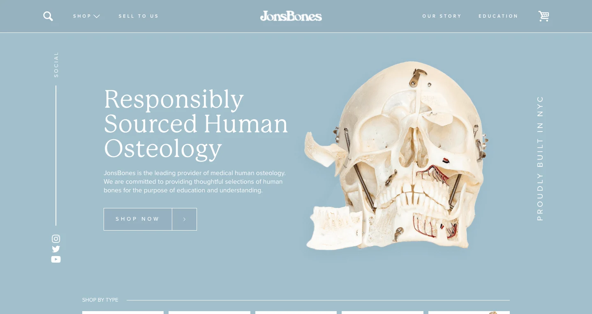

# JonsBones Website

This is my 11th project which is a clone of JonsBones Website.

## Screenshots



## Get started

Install all modules and their dependencies that are listed on package.json file:

```bash
npm install
```

Watch the SCSS files and compile the CSS file:

```bash
npm run compile:sass
```

## Built with

- HTML
- CSS
- JS (For the navbar and the parallax effect)
